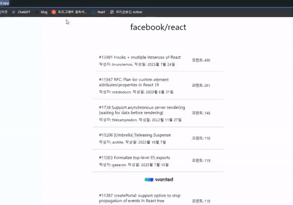
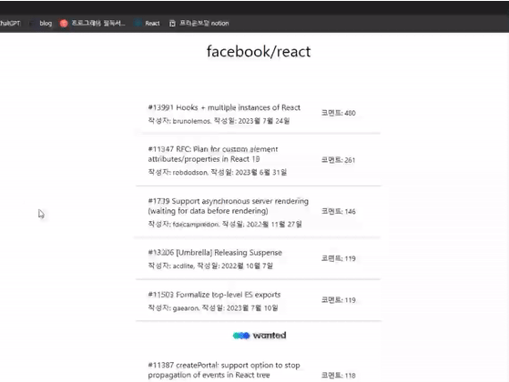
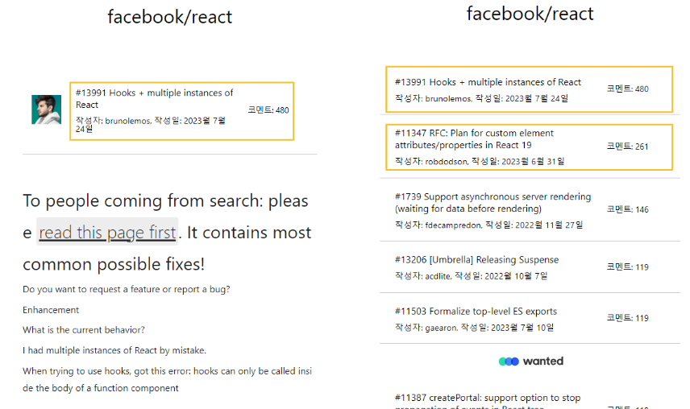

# 프리온보딩 2주차 개인 과제 - 윤다솜

특정 깃헙 레파지토리 (https://github.com/facebook/react/issues) 의 이슈 목록과 상세 내용을 확인하는 웹 사이트 구축하기

<br/>
<br/>

# 배포

https://pre-onboarding-12th-2-iota.vercel.app/

<br/>
<br/>

# 신경쓴 점

## 1. state 관리

- context api를 사용하여 전역 state 관리하였습니다.
- useIssue, useIssues를 사용하여 API 호출과 관련된 custom hook을 만들어 컴포넌트 UI와 `관심사의 분리`를 하였습니다. 해당 custom hook은 api 호출과 api호출로 가져온 데이터를 context안의 state로써 세팅합니다.
  <br/>

src/contexts/IssueContext.tsx

```tsx
export function IssueContextProvider({ children }: { children: ReactNode }) {
  const [issues, setIssues] = useState<Issues>([]);
  const [issue, setIssue] = useState<Issue>({});

  return (
    <IssueContext.Provider
      value={{
        issues,
        issue,
        setIssue,
        setIssues,
      }}
    >
      {children}
    </IssueContext.Provider>
  );
}
```

<br/>

src/hooks/useIssues.ts

```tsx
import { useRef, useContext } from 'react';
import { getIssues } from '../apis/remotes';
import useHttp from './useHttp';
import { IssueContext } from '../contexts/IssueContext';
import { Issues } from '../types/Issue';

const useIssues = () => {
  const { isLoading, sendRequest, error } = useHttp();
  const { setIssues } = useContext(IssueContext);

  const pageRef = useRef(1);
  const isEndRef = useRef(false);

  async function fetchIssues() {
    if (!isLoading) {
      const newIssues = await sendRequest(getIssues, pageRef.current);
      if (!newIssues) return [];
      if (newIssues.length === 0) {
        isEndRef.current = true;
        return;
      }
      pageRef.current = pageRef.current + 1;
      setIssues((prevIssues: Issues) => [...prevIssues, ...newIssues]);
    }
  }

  return { fetchIssues, isLoading, error };
};

export default useIssues;
```

<br/>
<br/>

---

## 2. 에러 핸들링

### 없는 페이지에 접근할 때


<br/>

### API 응답에서 에러가 날 때



---

<br/>
<br/>

## 3. 중복되는 컴포넌트를 공통 컴포넌트로 구현

중복되는 컴포넌트를 하나의 합성 컴포넌트로 구현하여 재사용성을 높임


<br/>

/src/components/Issue/IssueInfo

```jsx
export default function IssueInfo(props: Props) {
  const {
    type = 'list',
    issueNumber,
    date,
    title,
    author,
    comments,
    handleClickIssue,
  } = props;

  const formatDate = () => {
    if (typeof date !== 'string') return;
    const dateObj = new Date(date);
    return `${dateObj.getFullYear()}월 ${dateObj.getMonth()}월 ${dateObj.getDate()}일`;
  };

  return (
    <Wrapper type={type} onClick={() => handleClickIssue(issueNumber)}>
      <div>
        <Title>
          #{issueNumber} {title}
        </Title>
        <SubTitle>
          작성자: {author}, 작성일: {formatDate()}
        </SubTitle>
      </div>
      <Comment>코멘트: {comments}</Comment>
    </Wrapper>
  );
}
```
