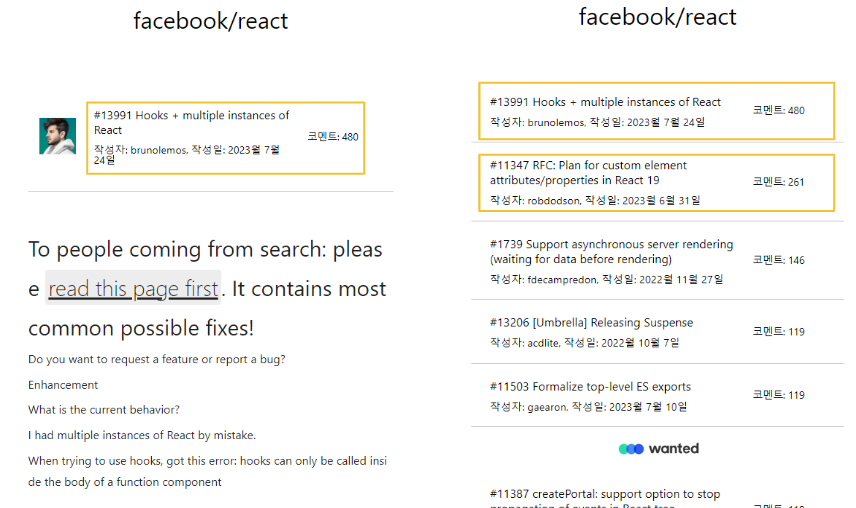

# 프리온보딩 2주차 개인 과제 - 윤다솜

목표특정 깃헙 레파지토리(https://github.com/facebook/react/issues)의 이슈 목록과 상세 내용을 확인하는 웹 사이트 구축하기

---

# 신경쓴 점

### 관심사의 분리

/src/components/hooks/useInfinityScroll.ts

- intersection observer를 이용한 무한스크롤 관련 custom hook

/src/contexts/IssueContext.tsx

- Api loading, error, Issue data, 무한스크롤에 이용되는 다음에 가져와야 할 page까지 context에서 관리

/src/components/UI/Loading

- Loading 컴포넌트 분리

---

### 중복되는 컴포넌트를 공통 컴포넌트로 구현

중복되는 컴포넌트를 하나의 합성 컴포넌트로 구현하여 재사용성을 높임



/src/components/Issue/IssueInfo

```jsx
export default function IssueInfo(props: Props) {
  const {
    type = 'list',
    issueNumber,
    date,
    title,
    author,
    comments,
    handleClickIssue,
  } = props;

  const formatDate = () => {
    if (typeof date !== 'string') return;
    const dateObj = new Date(date);
    return `${dateObj.getFullYear()}월 ${dateObj.getMonth()}월 ${dateObj.getDate()}일`;
  };

  return (
    <Wrapper type={type} onClick={() => handleClickIssue(issueNumber)}>
      <div>
        <Title>
          #{issueNumber} {title}
        </Title>
        <SubTitle>
          작성자: {author}, 작성일: {formatDate()}
        </SubTitle>
      </div>
      <Comment>코멘트: {comments}</Comment>
    </Wrapper>
  );
}
```

---

## 더 구현하고 싶은 점

- 시간이 있다면 useFetch를 만들어 api 호출 및 error, loading값을 관리하고, context에서는 데이터 상태관리만 하도록 하는게 더 좋을 것 같다.
